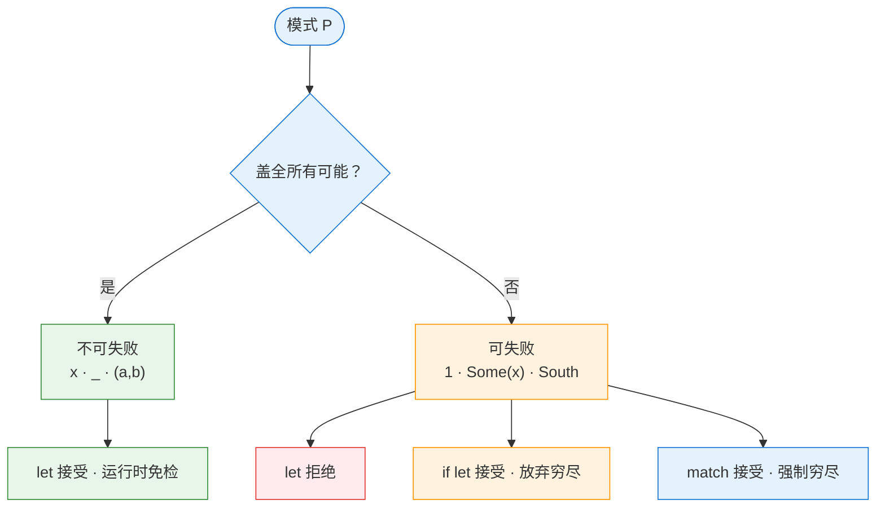

# 模式匹配与枚举

> 谈了 `match` 的 or-pattern、`let` 其实一直在做模式匹配、模式到底是什么、可失败性如何决定 `let`/`if let`/`match` 的取舍、shadowing vs 赋值、两种 enum、enum 与整数的转换、`==` vs `matches!`。一条主线贯穿：**Rust 把"可能出错的事"从运行时挪到编译时**。

---

## `match` 的 `|`：是「或模式」，不是「或表达式」

```rust
match dire {
    Direction::East => ...,
    Direction::North | Direction::South => ...,   // ← or-pattern
    _ => ...,
}
```

`|` 在这里是**模式层的或**（or-pattern），把两个模式合并成一个「匹配 North 或 South」。它**不是** `if` 里那种布尔或 `||`：

| | `match` 里的 `\|` | `if` 里的 `\|\|` |
|---|---|---|
| 工作层次 | **模式层** | **布尔表达式层** |
| 两边放什么 | 模式（`North`、`1`、`Some(_)`） | 求值为 `bool` 的表达式 |
| C++ 类比 | `case A: case B:` fallthrough | `a \|\| b` |

---

## `let` 的真相：它一直在做模式匹配

最容易栽的认知盲点：以为 `let x = 5` 是「赋值」。**不是。** 它是：

```rust
let <模式> = <表达式>;
```

`x` 只是「最朴素的模式」（绑定模式）。证据是这些都能写：

```rust
let x = 5;                // x 是绑定模式
let (a, b) = (1, 2);      // (a, b) 是元组模式
let Struct { x, y } = s;  // 结构体模式
```

全是同一件事：**把右边「解构」进左边的模式里**。`let` 的本职就是「模式匹配 + 绑定」。

**位置决定身份**——同一个 `5`：

```rust
let x = 5;     // 右边的 5：表达式，算出一个值
let 5 = x;     // 左边的 5：模式，描述「我期望 x 等于 5」
```

放右边是值，放左边是模式。「模式」不是新语法，是「东西出现在等号/match arm 左边时，被当作形状说明书来用」。

---

## 模式是什么：一张「形状说明书」

> **模式是描述数据「形状」的东西。它不算值，它的活是「检验 + 提取 + 绑定」。**

类比 JS 解构的强化版：

```js
const [a, b] = arr;     // JS 解构
let (a, b) = (1, 2);    // Rust 模式，同思路
```

Rust 走得更远——模式里能塞「具体值」和「结构」，所以能按形状筛选：

```rust
match v {
    Some(3) => ...,   // 结构 + 字面量：必须是 Some 且里面是 3
    Some(x) => ...,   // 结构 + 绑定：Some，里面取出来叫 x
    None    => ...,   // 字面形状：None
}
```

四类基本模式：

| 模式 | 长这样 | 在说什么 |
|---|---|---|
| 绑定 | `x` | 「不管是什么，全收下，叫它 x」 |
| 通配 | `_` | 「不管是什么，收下但不要名字，丢弃」 |
| 字面量 | `3`、`true` | 「必须等于这个具体值才算匹配」 |
| 结构 | `Some(...)`、`(a,b)`、`S{a,b}` | 「按这个结构拆开，里面再递归匹配」 |

模式可**递归嵌套**：`Some((0, x))` 合法——结构里套结构，结构里套字面量。

---

## 可失败性：决定一切的那把钥匙

前两类（绑定、通配）**永远匹配** → 不可失败（irrefutable），`let` 接受。
后两类（字面量、结构）**可能匹配不上** → 可失败（refutable），`let` 拒绝。

```rust
let x = 5;                    // ✅ 不可失败
let (a, b) = pair;            // ✅ 不可失败
let Some(x) = v;              // ❌ 编译错：refutable pattern in local binding
let Direction::South = dire;  // ❌ 同样可失败，同样被拒
```

> **`let` 只收不可失败的模式——也就是必须盖住这个类型的所有可能。盖不全 → 可能失败 → `let` 不要。**

报错里那句 `Variant2 not covered` 字面就是：「你的模式没盖全，万一它是 Variant2 呢？绑什么？没着落。」

### 三者对穷尽性的要求不同

| | 对穷尽性的要求 | 漏了变体怎么办 |
|---|---|---|
| `match` | **必须穷尽**（所有 arm 合起来盖全） | 编译错误，逼你补 |
| `let` | 模式本身**必须不可失败**（单个模式盖全） | 编译错误，根本不让写 |
| `if let` | **可以不穷尽** | 没关系，漏的走 else / 跳过 |

`let Some(x)` 死在第二行；`if let Some(x)` 活在第三行——同一棵树上，要求不同而已。

### 可失败性还决定「运行时查不查」

这是零成本抽象的影子：

```rust
let x = 5;                          // 不可失败：编译期已保证，运行时【免检】，0 次比较
let (a, b) = pair;                  // 同理，直接拆，0 次比较
if let Direction::South = dire {}   // 可失败：运行时【真要查一次】枚举的判别标记
```

> 编译期，编译器决定「运行时要不要检查」：不可失败模式它拍胸脯保证成功，运行时免检；可失败模式它知道有风险，运行时才真做一次判断。



---

## `if let`：可失败模式的语法糖

**它是一个组合关键字，整体读「如果这次 `let` 绑定能成功」**——不是 `if` 套着 `let`。

```rust
if let P = E { A } else { B }
// ≡
match E { P => A, _ => B }
```

用简洁换掉了穷尽性检查，所以只该用在「我真的只关心一两种，其余随便丢」的场景。

### 什么时候用 if let，什么时候必须 match

- **不在乎穷尽、只盯一种** → `if let`（或 `match` + `_`）
- **想要「新变体提醒我」这种保护** → `match` + 显式列举，**永远不碰 `_`**

```rust
enum E { A, B, C }

// 想要「将来加 D 时编译器提醒我」：
match a {
    E::A => println!("A"),
    E::B | E::C => (),    // ✅ 显式列举，不用 _
}
// 若写成 _ => ()，将来加 D 会被 _ 默默吞掉，不提醒
```

> **`_` 一写，穷尽性检查就失效了。** `_` 留给「真的只关心少数几个、其余一律丢弃」的场景（错误兜底之类）。

---

## shadowing vs 赋值：别再叫「赋值」了

```rust
let age = Some(30);              // 外层 age : Option<i32>
if let Some(age) = age {         // 内层 age : i32 ← 类型变了！
    println!("{}", age);         // 30
}
println!("{:?}", age);           // Some(30) ← 外层 age 原样复活
```

内层 `age` 是一个**全新变量**，和外面只共享「名字」。这叫**遮蔽（shadowing）**，不是赋值：

| | 赋值 `age = ...` | 遮蔽 `let age = ...` |
|---|---|---|
| 对象 | 改**同一个**变量 | **新建**同名变量，盖住旧的 |
| 类型 | 必须一致 | **可以不同**（`Option<i32>` → `i32`） |
| 原变量 | 被覆盖 | **原封不动**，出作用域还能用 |

**能换类型，只可能是「新建了一个同名变量」**——这是遮蔽和赋值最硬的差别。赋值需要一个能改的容器；`Direction::South`、`Some(30)` 都不是容器，是形状标签，你没法往里「塞」东西。

> Rust 的 `=` 在 `let` 语境里是「匹配/绑定号」，不是赋值号。真正的赋值是 `let mut x = 5; x = 6;` 里第二行那种（无 `let`，改已存在的 `mut` 变量）。

> **绑定 vs 赋值的根本差别**：C/JS 心智是「变量 = 盒子，赋值 = 往盒子里放」；Rust 心智是「`let x = v` = 让 `x` 这个名字**拥有** `v`」。绑定确立的是**所有权关系**——这是 `move` / `borrow` 那一堆规则的起点。

---

## 两种 enum：长得像，本质不同

```rust
enum MyEnum  { Variant1(i32), Variant2 }   // 带数据：标签联合体
enum MyEnum2 { Variant1 = 1, Variant2 = 2 } // 无数据：整数的名字
```

Rust 的 enum 是 C++ 里**两种东西的合体**：

| | `MyEnum` | `MyEnum2` |
|---|---|---|
| ≈ C++ | `std::variant`（标签联合体） | C 的 `enum { A=1, B=2 }` |
| 变体本质 | 形状标签（可能带数据） | 整数的名字 |
| 有整数值吗 | **没有**，就是个标签 | 有判别值 `1`/`2`，要 `as` 取 |

**变体的类型都不是整数**，都是各自枚举的类型：

| | `MyEnum::Variant2` | `MyEnum2::Variant2` |
|---|---|---|
| 类型 | `MyEnum` | `MyEnum2`（**不是 i32！**） |
| `as i32` | ❌ 编译错（enum 含带数据变体，非 field-less） | ✅ `… as i32` → `2` |

> 内存里编译器当然用个判别标识（discriminant，个小整数）记住「这是哪个变体」，但那是**实现细节**，对带数据 enum 不暴露成可用的值。只有**所有变体都不带数据**（field-less）的 enum 才能 `as` 成整数——只要有一个变体带数据，整个 enum 退回「标签联合体」，谁都别想 `as`。

---

## enum ↔ 整数：Rust 没给你「裸转换」的口子

| 方向 | C++ | Rust |
|---|---|---|
| enum → int | `static_cast<int>(e)` | `e as i32`（安全，变体判别值合法） |
| int → enum（**不检查**） | `static_cast<Enum>(x)` ✅ 默认 | **没有**；`as` 不支持反向。想不检查只能 `unsafe { transmute }` |
| int → enum（**检查**） | 无内置，自己封装 | `TryFrom`，返回 `Result` |

C++ 的 `static_cast<Enum>(99)` 无条件转，给你一个「合法但不对应任何命名变体的怪值」——bug 温床。Rust 偏要你走 `TryFrom`：

```rust
impl TryFrom<i32> for MyEnum2 {
    type Error = ();
    fn try_from(v: i32) -> Result<Self, Self::Error> {
        match v {
            1 => Ok(MyEnum2::Variant1),
            2 => Ok(MyEnum2::Variant2),
            _ => Err(()),              // ← 不在范围内就 Err，无处可逃
        }
    }
}
```

> `TryFrom` 不是自带的——标准库不给自定义 enum 自动实现，要手写或用 `num_enum` / `derive_more` 的 `#[derive(TryFrom)]`。

---

## `==` vs `matches!`：Rust 没有「内置相等」

```rust
v.iter().filter(|x| x == MyEnum::Foo);      // ❌ 不行
v.iter().filter(|x| matches!(x, MyEnum::Foo)); // ✅
```

`==` 不行的真正原因：**`MyEnum` 没实现 `PartialEq` trait**。Rust 的 `==` 背后是 `PartialEq::eq` 方法，不是语言自带运算符。

`matches!` 是模式匹配的语法糖，**不依赖任何 trait**：

```rust
matches!(x, MyEnum::Foo)
// ≡
match x { MyEnum::Foo => true, _ => false }
```

| | 依赖什么 | 要不要 opt-in |
|---|---|---|
| `matches!` / `match` / `if let` | **语言内置的模式匹配** | 不要，开箱即用 |
| `==` | **`PartialEq` trait** | 要，必须 `derive` 或手写 |

想让 `==` 也能用，加 `#[derive(PartialEq, Eq)]`：

```rust
#[derive(PartialEq, Eq)]
enum MyEnum { Foo, Bar }
v.iter().filter(|x| **x == MyEnum::Foo);   // ⚠️ 注意 **x（filter 闭包隔着两层引用）
```

`matches!` 还天然处理引用（不用纠结 `*x`/`**x`），且能写 `==` 写不了的复杂模式：

```rust
matches!(x, MyEnum::Foo | MyEnum::Bar)   // or-pattern 直接上
```

> 延伸：enum 想进 `HashSet` 当 key，除 `PartialEq`/`Eq` 还要 `Hash` + `Clone`。`==` 只问「相不相等」，`HashSet` 还得知道「往哪个桶放」。

---

## 一以贯之的 Rust 哲学

今天所有话题其实是**同一招**：

> **凡是可能失败/出错的事，Rust 就不让你装作它不会。**

- match 必须**穷尽**（漏 arm 编译错）
- 可失败模式**不能裸 `let`**（必须 if let / match）
- int → enum 必须 **TryFrom**（返回 `Result`）
- enum 默认**不可比**（要显式 derive `PartialEq`）
- 不检查的转换只锁在 **`unsafe`** 里

别的语言默认给你「相等、可强转、自动兜底」图省事，代价是运行时翻车。Rust 把每一样改成「**你得显式声明你要这个语义**」——代价是写起来啰嗦，换来的是把错误从运行时挪到编译时 / 类型里。

---

## 相关笔记

- [[迭代器]] — `filter` 闭包里 `matches!` vs `==` 的现场
- [[unit类型与空元组]] — `()` 作为模式、`Result<(), E>` 只关心成败
- [[Rustlings 笔记]] — 练习里的模式匹配与枚举题
