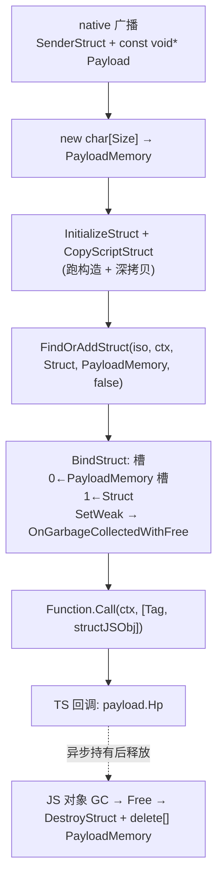
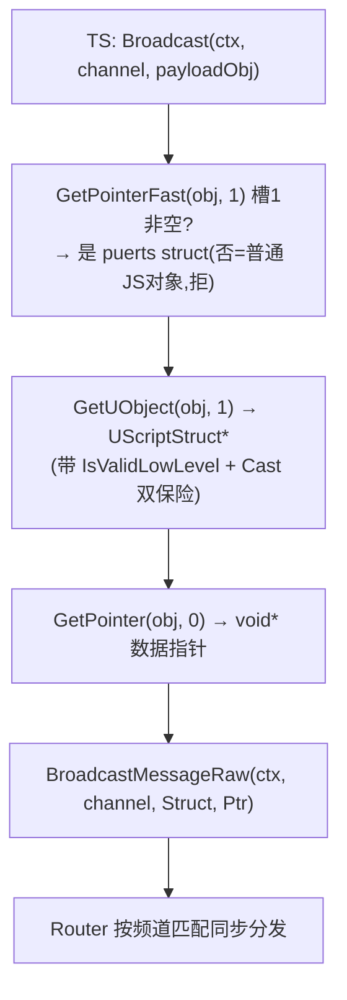
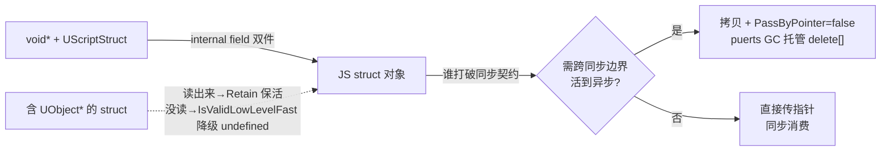

# Puerts 结构体跨边界与 void* 还原

> 引子：GameplayMessage 给 C++ 侧的回调签名是 `const UScriptStruct* SenderStruct, const void* Payload`——一坨**类型擦除**的值：数据裸躺在内存里，类型信息单独拎在外面。puerts 怎么把它变回 TS 能点的对象？又怎么反向把 TS struct 喂回 native？
>
> 这篇是我在写 `UGameplayMessageProxySubsystem`（C++→TS 桥接托管层）时对着 puerts 源码深挖的笔记，外加四个边界追问的复盘——**我对的部分、错的部分，都摆出来。**

## 一、心智模型：每个 puerts struct 对象 =「数据指针 + 类型」双件

`void* + UScriptStruct*` 这种类型擦除，跟几个老朋友是一个套路：

| 语言 | 数据 | 类型信息 |
|---|---|---|
| UE GameplayMessage | `void* Payload` | `UScriptStruct*`（反射：字段偏移/属性类型） |
| Lua (unlua/slua) | `userdata` 内存 | `metatable` |
| C++ | `void*` | 脑子记 / RTTI |

puerts 把这对塞进 V8 对象的 **internal field**（V8 对象上**不暴露给 JS** 的隐藏槽）：

```mermaid
graph LR
  JS["JS payloadObj<br/>{ Hp: 100, ... }"]:::blue
  IF0["InternalField 逻辑槽0<br/>= void* 数据指针"]:::orange
  IF1["InternalField 逻辑槽1<br/>= UScriptStruct* 类型"]:::orange
  Mem["native struct 内存"]:::purple
  Meta["UScriptStruct 反射<br/>(字段偏移/属性类型)"]:::purple
  JS -.隐藏.-> IF0
  JS -.隐藏.-> IF1
  IF0 --> Mem
  IF1 --> Meta
  Meta -. 读 payload.Hp 时<br/>按偏移去 Mem 取 .-> Mem
```

> 细节：puerts 把一个指针**拆成高位/低位塞进两个物理槽**（`SetAlignedPointerInInternalField(Index*2, High)` + `Index*2+1, Low`），为了兼容 32 位环境存 64 位指针。所以 `GetPointer(obj, 0)` / `GetUObject(obj, 1)` 的 `0/1` 是**逻辑索引**，物理上各占 2 槽——这就是为什么 struct 对象的 `InternalFieldCount` 是 4。（`DataTransfer.h:252` / `:283`）

这个双件就是一切的根：`FindOrAddStruct` 负责往槽里**写**，`GetPointer` / `GetUObject` 负责**读**。

## 二、三个底层 API 真相

### 1. `FindOrAddStruct`（`JsEnvImpl.cpp:1825`）—— 按指针缓存

```
StructCache.Find(Ptr)  → 命中？返回同一个旧 JS 对象，不重新包装
                      → 未命中？GetTemplateInfoOfType → InstanceTemplate->NewInstance() → BindStruct(...)
```

**缓存 key 是数据指针 `Ptr`**。这埋了一个坑（见追问 1）。

### 2. `BindStruct`（`JsEnvImpl.cpp:2894`）—— 写槽 + 注册 GC 回调

```cpp
SetPointer(iso, JSObject, Ptr, 0);                     // 槽0 = 数据指针
SetPointer(iso, JSObject, UScriptStruct*, 1);          // 槽1 = 类型
if (!PassByPointer) {
    SetWeak(...OnGarbageCollectedWithFree);            // GC 时 delete[]
} else {
    SetWeak(...OnGarbageCollected);                    // GC 时只解绑，不 free
}
```

### 3. `PassByPointer` —— 所有权开关，**不是读写开关** 🔴

这是我最初搞混的点，单独拎出来：

| PassByPointer | 含义 | GC 时 |
|---|---|---|
| `false` | puerts **接管**这块内存 | `OnGarbageCollectedWithFree` → `DestroyStruct` + `delete[] Ptr` |
| `true` | puerts **借用**指针，不拥有 | `OnGarbageCollected` → 只从 StructCache 解绑，**不动内存** |

`Free()`（`StructWrapper.cpp:655`）的实现：
```cpp
if (InStruct.IsValid()) InStruct->DestroyStruct(Ptr);   // 跑 UE 析构(对称 InitializeStruct)
delete[] static_cast<char*>(Ptr);                         // ← 注意是 delete[]
```

## 三、我的实现：两个方向

### C++ → TS（`RegisterGameplayMessageListenerForPuerts` 的回调）



**为什么必须深拷贝？** —— 本质是**所有权语义的翻译**：native payload 是发送方的同步临时内存，dispatch 完随时销毁；JS 对象是 GC 管理的异步生命体，TS 可能把它塞进 Promise/setTimeout 异步用。不拷贝 = 把"native 同步所有权"硬塞给"JS GC 所有权"，迟早读野指针。`new` 一份独立内存 + 交给 puerts GC 托管（`false`），让 JS 对象拥有自洽的独立所有权。

### TS → C++（`BroadcastGameplayMessageForPuerts`）



`TryGetPuertsStruct` 是**双保险鸭子类型检查**：
- `GetPointerFast(obj, 1)` —— 槽1有没有东西？纯 JS `{}` 没有 internal field → 返回 nullptr → 拒。这步不碰 GC、不跑反射，很快。
- `GetUObject(obj, 1)` + `Cast<UScriptStruct>` —— 即使槽1非空，也得验证它真是 `UScriptStruct`（而不是别的 UObject）。两道关都过才认。

## 四、四个边界追问复盘（对错对照）

### 追问 1：缓存按指针 key 的陷阱

> **我答**：每次 copy 新内存，指针不同，不命中缓存，不出事。代价是内存分配/碎片。payload 多在栈上，不 copy 万一 TS 异步持有就崩。当 TS 要修改 C++ 引用时才用 `PassByPointer=true`。

- ✅ **对**：每次 `new char[]` → 指针不同 → 不命中缓存 → 规避复用。代价确实是每次堆分配。
- ✅ **对**：栈上 payload + TS 可能异步持有 → 必须拷贝。所有权翻译的判断正确。
- ❌ **错误直觉**：「TS 要修改 C++ 引用时才用 `PassByPointer=true`」。
  - `PassByPointer` 是**所有权开关**，**不是读写开关**。TS 写字段对 `true`/`false` 都一样（都是直接写槽0指针那块内存，读写语义不受它影响）。
  - `true` 的真正用途：让 TS 与 C++ **共享同一块内存**（读写互通、零拷贝），且这块内存**生命周期由 C++/外部保证**（TS 对象存活期间 C++ 不会 free）。
  - **GameplayMessage listener 场景，永远该用 `false`（拷贝）**。payload 是发送方的临时内存，用 `true`（puerts 不 delete）+ 发送方回收 = TS 持有野指针，比不拷贝还危险。

### 追问 2：`delete[]` vs `new[]`

> **我答**：八股，`new[]` 配 `delete[]`，不匹配不调析构但能回收内存。char 类型可能不出事。

- ✅ **对**：分配/释放器要配对。
- 🔧 **补正**：puerts 用 `delete[] static_cast<char*>(Ptr)`，所以分配**必须** `new char[]`。char「碰巧能回收」是 trivially-destructible 的实现巧合（UB，不能当设计依据）。更要命的是**分配器不匹配**：`malloc` / `FMemory::Malloc` / 单对象 `new Type` 配 `delete[]` 是严重 UB（`malloc` 的内存不是 `operator new[]` 分配的）。
  - 一句话：**malloc↔free、new[]↔delete[]、FMemory::Malloc↔FMemory::Free 三套各自配对，不能混。**

### 追问 3：含 `UObject*` 的 struct 与 UE GC —— 盲点 + 翻车修正

> **我答**：盲点。payload 持有 `UObject*` 时怎么告诉 UE「别回收」？

**🔴 第一版结论（已推翻，留着当翻车现场）**：我最初只挖到 `FJsEnvImpl : FUObjectDeleteListener`，误以为是「被动失效、不替你保活、靠哨兵降级」。**挖浅了一层就下结论，错了。**

**✅ 挖深一层（`SetJsTakeRef`）后的真相：puerts 主动保活。**

`JsEnvImpl.cpp:1772`：
```cpp
void FJsEnvImpl::SetJsTakeRef(UObject* UEObject, FClassWrapper* ClassWrapper) {
    UserObjectRetainer.Retain(UEObject);   // ← UserObjectRetainer 是 FGCObject！
    ObjectMap[UEObject].SetWeak<UClass>(...);
}
```
`UserObjectRetainer : FGCObject`（`ObjectRetainer.h:29`），`AddReferencedObjects` 把持有的 `TSet<UObject*>` 告诉 UE GC → **JS 持有的 UObject 被 puerts 主动保活**，只要 JS 还引用着，UE 不回收。`FUObjectDeleteListener` 只是**兜底**：处理被 native 强制销毁（非 JS weak 路径，如 `Destroy()`）的对象，置 `RELEASED_UOBJECT` 哨兵。

**命门：`FObjectPropertyTranslator::UEToJs`（`PropertyTranslator.cpp:475`）的双保险**

```cpp
UObject* UEObject = ObjectBaseProperty->GetObjectPropertyValue(ValuePtr);  // 从 struct 内存取裸指针
if (!UEObject || !UEObject->IsValidLowLevelFast() || UEObjectIsPendingKill(UEObject))
    return v8::Undefined(Isolate);   // ← 无效 → undefined（不是 null！不是崩！）
return FindOrAdd(...);               // 有效 → Bind → SetJsTakeRef → 主动保活
```

所以 struct 字段里的 `UObject*` 被回收后，TS 读它 = **拿到 `undefined`，不崩**。`IsValidLowLevelFast` 靠检查对象内部字段（`InternalIndex` 在 `GUObjectArray` 范围、`OuterPrivate`、vtable）的合理性识别回收（pending kill / slot 复用）；边界：内存被完全释放并重用成另一个合法 UObject 时可能漏判——极罕见。

**异步 setTimeout 场景的两种情况：**

| | GC 前读过？ | setTimeout 后读 |
|---|---|---|
| **A 读过** | → `Bind` → `UserObjectRetainer.Retain` 保活 | 目标仍有效 ✅ |
| **B 没读过** | 裸指针不在 Retainer，可能被 UE GC | 读时 `IsValidLowLevelFast` 失败 → `undefined` |

两种都不崩。A 拿活对象，B 拿 undefined。

**TS 侧坑**：puerts 返回 **`undefined` 不是 `null`**。判空用 `if (target)` 或 `target == null`（宽松相等 catch null+undefined），`target === null` 会漏掉 undefined。

**`CopyScriptStruct` 对 `UObject*` 是浅拷贝**（只复制指针值，不 AddReferenced）。但只要 TS 读出该字段，puerts 就 Retain 保活——浅拷贝不影响情况 A 的安全。

**GameplayMessage 实践**：同步分发 + 同帧读，Target 被立刻 Retain 保活，后续异步访问仍有效（情况 A）。要触发降级得是「从不读 + Target 被 UE 回收」（情况 B），且也是 undefined 降级不崩。

### 追问 4：为什么监听侧拷贝、广播侧不拷贝？

> **我答**：C++ 回调有 const 约束，且分发都在同一函数栈上，不会回收。

- ✅ **结论对**（broadcast 不拷贝是对的）。
- ❌ **错误因果**：「const 约束」不是不拷贝的原因。const 只保证这个函数内不改，跟内存生命周期无关。
- ✅ **真正原因**：保证来自 GameplayMessage 的**「同步 dispatch 契约」**。整个 broadcast 在同一调用栈同步完成，所有 listener 同步消费 payload 指针，调用方 TS 自己拥有这个 struct 对象 → 不拷贝也安全。
- 🔑 **对称性的根源**：**谁的 JS 化打破了「同步分发契约」，谁就得拷贝。**
  - Broadcast：调用方自拥、同步消费 → 不拷贝。
  - Listener 回调：把 native 同步的 `const void*` 包装成可能被 TS 异步持有的 JS 对象 → 打破同步契约 → 必须拷贝赋独立所有权。
  - 这把追问 1 和追问 4 串起来了：拷不拷贝的判据是**是否需要让对象跨越 dispatch 的同步边界活到异步世界**。

## 五、一句话总结



> puerts 的 GC 哲学：**struct 内存靠拷贝 + puerts GC 接管（PassByPointer=false）；struct 里的裸 `UObject*` 读出来才被 `UserObjectRetainer` 主动保活，没读不保活但读时 `IsValidLowLevelFast` 降级 `undefined` 不崩**。值类型自己扛生命周期，对象类型「JS 一触碰即 Retain 保活」——跟普通 C++「持有 UObject 要 AddReferencedObjects」其实**同向**，只是 puerts 把「读字段」这个动作当成触发点。

## 六、测试验证：钉死「undefined 不是 null」

上面的「情况 B」结论（struct 里裸 `UObject*` 失效后 TS 读得 `undefined`，不崩）是**可证伪**的，值得跑个最小用例钉死它。测试代码见同目录的 `PuertsGCTest.h / .cpp / .ts`。

> 复制到你 UE 项目：`PuertsGCTest.h` → `Source/mkg/Public/Test/`，`PuertsGCTest.cpp` → `Source/mkg/Private/Test/`，`PuertsGCTest.ts` → 你的 TS 脚本目录；编译后跑一次 puerts 的 d.ts 生成，TS 才有 `UE.UPuertsGCTestLib` 类型。

### 测试设计的两个坑（为什么这么写）

1. **Target 不能经过 TS 的手** —— 一旦 TS 写 `const t = lib.MakeTarget()`，puerts 包装它时就 `SetJsTakeRef → UserObjectRetainer.Retain` 保活了（情况 A）。所以 Target 必须藏在 C++ 返回的 struct 里，TS **全程不读 `.Target`**，直到验证那一刻才第一次读。
2. **Target 不能靠自然 GC 回收** —— `NewObject<UObject>(GetTransientPackage())` 挂在持久包下，`TransientPackage` 是 root set，子对象**永不被 GC**。必须用 `ConditionalBeginDestroy` 主动让它失效 + `ForceGC` 清理。

### 预期结果

| 表达式 | 预期 | 说明 |
|---|---|---|
| `typeof t` | `"undefined"` | `UEToJs` 走 `IsValidLowLevelFast` 失败分支 |
| `t === null` | `false` | **反直觉点**：是 undefined 不是 null |
| `t == null` | `true` | 宽松相等同时 catch null + undefined |
| `t?.Hp` | `undefined` | 安全访问，不崩 |

### 三种结果对应三种结论

- `typeof` 是 `"undefined"` → 结论对，puerts 走降级分支（`FObjectPropertyTranslator::UEToJs`）。
- 拿到 `"object"` 还能读 `.Hp` → Target 没销毁干净，加大 `setTimeout` 或多 `ForceGC` 一次。
- 抛异常 / 崩 → 结论错，回来挖 `FObjectPropertyTranslator` 或 `SoftObject` 分支。
