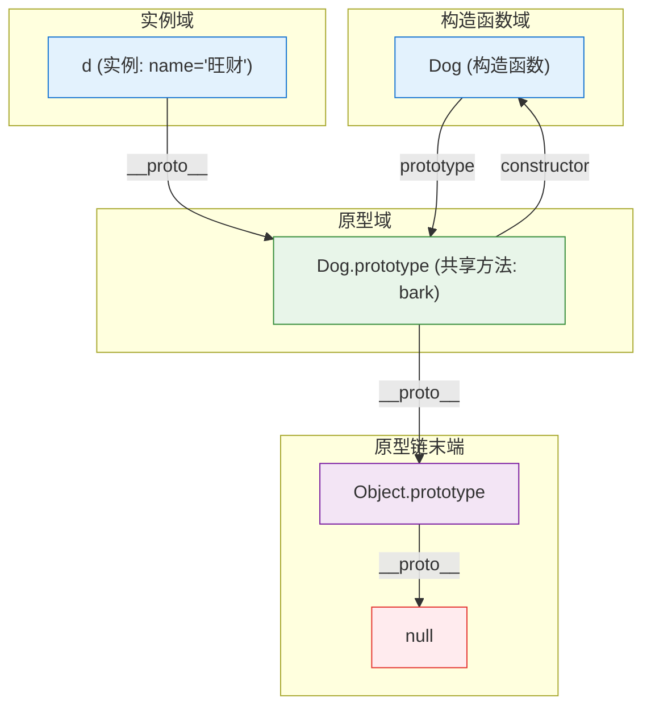
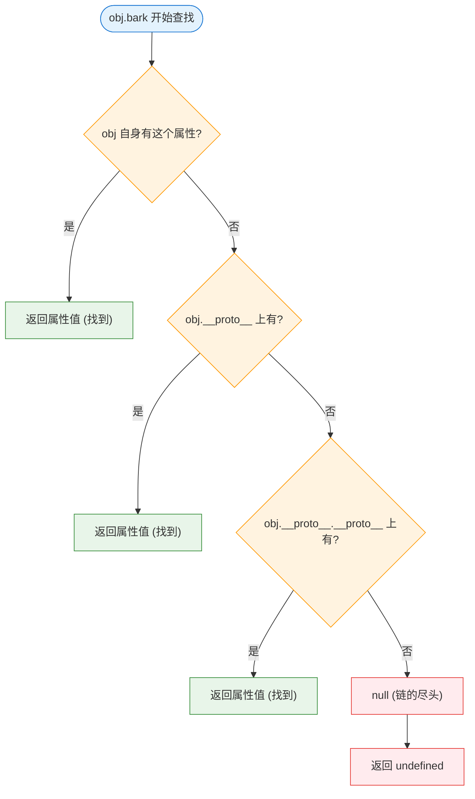

# JS 原型链：`prototype` 和 `__proto__`

> 一句话：JS 没有"类"——它靠一条链让对象共享方法。`prototype` 是**函数的属性**（模板），`__proto__` 是**对象的属性**（链指针）。

## 一句话区分

```
prototype  →  只有"函数"才有。是这个函数 new 出来的实例的共享方法仓库。
__proto__  →  每个"对象"都有。是"我找不到属性时往哪找"的指针。
```

```js
function Dog(name) { this.name = name; }
Dog.prototype.bark = function() { console.log(this.name + ' woof'); };

const d = new Dog('旺财');

d.__proto__ === Dog.prototype      // true —— 实例 → 共享方法仓库
Dog.prototype.constructor === Dog  // true —— 仓库上有个 constructor 指回去
```

## 实例、构造函数、原型三者的关系



- `new Dog()` 做两件事：创建一个空对象，把它的 `__proto__` 指向 `Dog.prototype`。
- 实例 `d` 自己没有 `bark` 方法 → 沿 `__proto__` → `Dog.prototype` 上找到。
- 链的尽头是 `null`，如果一直找不到就返回 `undefined`。

> C++ 对照：JS 的 `__proto__` 链 ≈ Lua 的 `setmetatable(t, {__index = parent})`——找不到属性时往另一个对象递归查找。区别是 Lua 元表更通用（能拦截算术、比较等 13 种操作），JS 的 `__proto__` 只管属性查找。

## `class extends` 搭了两座桥

```js
class Animal {}
class Dog extends Animal {}
```

不是一座桥，是两座：

```mermaid
graph TB
    subgraph "实例桥 (实例查找方法走这条)"
        DogProto["Dog.prototype"]
        AnimalProto["Animal.prototype"]
        ObjProto1["Object.prototype"]
        Null1["null"]
    end
    subgraph "静态桥 (静态方法继承走这条)"
        DogC["Dog (子类)"]
        AnimalC["Animal (基类)"]
        FuncProto["Function.prototype"]
    end

    DogProto -- "__proto__" --> AnimalProto
    AnimalProto -- "__proto__" --> ObjProto1
    ObjProto1 -- "__proto__" --> Null1
    DogC -- "__proto__" --> AnimalC
    AnimalC -- "__proto__" --> FuncProto

    style DogC fill:#e3f2fd,stroke:#1976d2
    style AnimalC fill:#e3f2fd,stroke:#1976d2
    style DogProto fill:#e8f5e9,stroke:#388e3c
    style AnimalProto fill:#e8f5e9,stroke:#388e3c
    style FuncProto fill:#fff3e0,stroke:#ff9800
    style ObjProto1 fill:#f3e5f5,stroke:#7b1fa2
    style Null1 fill:#ffebee,stroke:#e53935
```



| 桥 | 表达式 | 用途 |
|---|---|---|
| 实例桥 | `Dog.prototype.__proto__ === Animal.prototype` | 实例找方法时沿原型链递归 |
| 静态桥 | `Dog.__proto__ === Animal` | 静态方法继承（`Dog.myStatic()` 能调到 `Animal` 的） |

> C++ 没有"静态桥"这回事——C++ 的类在运行时不存在，`Dog.__proto__` 这种操作没有对等物。

### 为什么静态桥不是多余的：函数也是对象

这是 JS 里最容易漏掉的一个认知：**构造函数本身也是一个对象**（`typeof Dog === 'function'`，而 function 是 object）。

```
实例 d 是对象 → d.__proto__ 沿链找实例方法
构造函数 Dog 也是对象 → Dog.__proto__ 沿链找静态方法
```

**同一套 `__proto__` 机制，主角不同而已。** 实例找不到方法走实例桥，构造函数找不到静态方法走静态桥——两条桥逻辑完全对称：

```js
class Animal {
  static create() { return new this(); }   // 静态方法，挂在 Animal 上
}
class Dog extends Animal {
  static bark() { return 'woof'; }         // 静态方法，挂在 Dog 上
}

Dog.bark();    // ✅ Dog 自己就有，不走任何桥
Dog.create();  // ✅ Dog 自己没有 → Dog.__proto__ → Animal 找到
```

如果没有静态桥（`Dog.__proto__ === Animal`），`Dog.create()` 就报 `is not a function`。

> C++ 不需要这个——`Dog::create()` 编译期直接解析到 `Animal::create()`，是符号表查名，不涉及运行时对象。JS 里 `Dog` 是活得对象，必须走链。

### 手动模拟 vs `class extends`

```js
// 手动模拟（Object.create）—— 只搭了实例桥
function B() {}
B.prototype = Object.create(A.prototype);

// class extends（语法糖）—— 实例桥 + 静态桥，两条都搭
class B extends A {}
```

| 构造函数写法 | `class` 写法 | 本质操作 |
|---|---|---|
| `function Dog(){}` | `class Dog {}` | 创建函数对象 |
| `Dog.prototype.bark = fn` | `bark(){}` 在 class 体内 | 方法挂在 `prototype` 上 |
| `Object.create(A.prototype)` | `extends A` | 搭实例桥 |
| 无（需手动 `Object.setPrototypeOf`） | `extends A` | 搭静态桥 |

## 属性查找流程



### C++ 虚函数调用 vs JS 原型链

```
C++ 虚函数调用:                        JS 属性查找:
  obj->bark()                            obj.bark
    ↓                                      ↓
  vptr → vtable[bark_offset]           沿 __proto__ 递归查找
    ↓                                      ↓
  直接跳转到函数地址                    找到 → 调用 / 到 null → undefined
```

- C++：编译期确定 vtable 布局，运行时一次间接跳转（O(1)）。
- JS：运行时沿链递归查找，最坏走完整条链（O(n)），但 V8 有 inline cache 优化。

## 原型上的字段：读和写不一样

原型链对方法和字段一视同仁——找不到都往上爬。但**读和写的行为不同**。

### 读走原型链、写塞实例（shadowing）

```js
function Dog(name) { this.name = name; }
Dog.prototype.type = '犬科';

const d = new Dog('旺财');
d.type            // '犬科' —— 读：实例没有，沿 __proto__ 到原型
d.type = '柯基';   // 写：直接加在 d 自己身上，不碰原型
d.type            // '柯基' —— 实例自己的属性遮蔽了原型
Dog.prototype.type // '犬科' —— 原型没被改
```

这叫 **shadowing（遮蔽）**。C++ 里没这回事——C++ 字段编译期就定好偏移量，不存在"读走原型、写塞实例"的动静差异。

### 引用类型是坑

原型上的字段如果是对象/数组，所有实例共享同一个引用：

```js
Dog.prototype.tags = [];
const d1 = new Dog('旺财');
const d2 = new Dog('小黑');

d1.tags.push('乖');
d2.tags    // ['乖'] —— d2 也被改了！
d1.tags === d2.tags  // true —— 是同一个数组
```

> 这就是为什么**方法放原型、字段放构造函数**。方法天然不可变（共享没问题），字段需要每个实例独立一份。同样，Vue 组件的 `data` 必须是返回对象的函数而不是对象本身——就是为了避免多个组件实例共享同一个引用。

```bash
node -e "
function Dog(name) { this.name = name; }
Dog.prototype.type = '犬科';
Dog.prototype.tags = [];

const d1 = new Dog('旺财');
const d2 = new Dog('小黑');

// 读：原型链找 type
console.log('d1.type:', d1.type);           // 犬科（从原型读）
console.log('d2.type:', d2.type);           // 犬科（从原型读）

// 写：直接塞实例，不碰原型
d1.type = '柯基';
console.log('d1.type 写后:', d1.type);       // 柯基（实例自己）
console.log('d2.type 还在:', d2.type);       // 犬科（还是从原型读）
console.log('原型没变:', Dog.prototype.type); // 犬科

// 引用类型的坑
d1.tags.push('乖');
console.log('d1.tags:', d1.tags);           // ['乖']
console.log('d2.tags:', d2.tags);           // ['乖'] —— 也被改了！
console.log('是同一个数组?', d1.tags === d2.tags); // true
"
```

### 父类字段怎么跑到子实例上：`super()` = `Parent.call(this)`

```js
class Animal {
  constructor(name) { this.name = name; }    // 这是字段，不是原型上的
}
class Dog extends Animal {
  constructor(name, breed) {
    super(name);          // ← 关键：把父类构造函数在子实例的 this 上跑一遍
    this.breed = breed;   //   等价于 ES5 的 Animal.call(this, name)
  }
}
```

`super()` 本质上就是 `Parent.call(this)`——让父类构造函数的 `this.xxx = xxx` 在**子实例**上执行，把字段塞到子实例身上。

### C++ 对照

| | C++ | JS |
|---|---|---|
| 实例字段 | 编译期分配偏移，每个实例独立 | `this.xxx = xxx` 塞在实例上，每个实例独立 |
| 共享方法 | vtable 间接跳转 | `prototype` 上，沿 `__proto__` 找到 |
| 共享字段 | `static` 成员（类级） | 挂在 `prototype` 上的字段（注意引用类型坑） |
| 父类字段到子类 | 自动调父类构造 | 必须 `super()` / `Parent.call(this)` |
| 读 vs 写 | 无区别，编译期定死 | 读走链，写永远塞实例（shadowing） |

## 用 Node.js 跑

```bash
node -e "
function A() {}
A.prototype.hello = function() { return 'hello from A'; };

function B() {}
B.prototype = Object.create(A.prototype);  // 关键：搭实例桥
B.prototype.bye = function() { return 'bye from B'; };

const b = new B();

console.log('b.hello():', b.hello());
console.log('b.bye():',   b.bye());
console.log('b.__proto__ === B.prototype:', b.__proto__ === B.prototype);
console.log('b.__proto__.__proto__ === A.prototype:', b.__proto__.__proto__ === A.prototype);
console.log('B.__proto__ === A:', B.__proto__ === A);  // false! 手动模拟只能搭实例桥
console.log('自己的属性:', Object.keys(b));
console.log('原型链上的方法:', Object.keys(b.__proto__));
"
```

### 输出对照

| 表达式 | 值 | 为什么 |
|---|---|---|
| `b.hello()` | `"hello from A"` | `b` → `B.prototype` 没有 → `A.prototype` 找到 |
| `b.bye()` | `"bye from B"` | `B.prototype` 上直接找到 |
| `b.__proto__ === B.prototype` | `true` | `new` 自动把实例的 `__proto__` 指向构造函数的 `prototype` |
| `b.__proto__.__proto__ === A.prototype` | `true` | `Object.create(A.prototype)` 搭了实例桥 |
| `B.__proto__ === A` | **`false`** | `Object.create` 只能搭实例桥，搭不了静态桥 |
| `Object.keys(b)` | `[]` | 构造函数里没设 `this.xxx`，实例本身是空的 |

> 末尾的 `false` 是重点：手动模拟继承只能搭实例桥。`class extends` 语法糖两条都搭——这就是它存在的理由。

## Lua 对照

```lua
-- JS: class Dog extends Animal
-- 等价 Lua：

Animal = {}
function Animal:bark() return "woof" end

-- 实例桥：Dog.prototype.__proto__ = Animal.prototype
Dog_proto = {}
setmetatable(Dog_proto, {__index = Animal})

-- 静态桥：Dog.__proto__ = Animal
Dog = {}
setmetatable(Dog, {__index = Animal})

dog_instance = {name = "旺财"}
setmetatable(dog_instance, {__index = Dog_proto})

-- dog_instance:bark()  -- 自身 → Dog_proto → Animal ✓
-- Dog.bark()           -- Dog → Animal ✓（静态桥）
```

## JS 为什么会有 `class`：一段简史

### ES5 时代（2009）：只有构造函数 + 原型

JavaScript 从诞生起就是原型继承语言，没有 `class` 关键字。1995 年 Brendan Eich 设计它时甚至没打算加——原型链本身就能做继承，只是写法很"手工"：

```js
// ES5 写一个类：构造函数 + 手动搭原型链
function Animal(name) {
  this.name = name;
}
Animal.prototype.speak = function() {
  return this.name + ' makes a sound';
};

function Dog(name, breed) {
  Animal.call(this, name);                    // 手动调父类构造函数
  this.breed = breed;
}
Dog.prototype = Object.create(Animal.prototype);  // 手动搭实例桥
Dog.prototype.constructor = Dog;                   // 手动修 constructor 指向
Dog.prototype.bark = function() {
  return 'woof';
};

// 静态方法？用 Object.setPrototypeOf 或者干脆不继承
Object.setPrototypeOf(Dog, Animal);  // 手动搭静态桥（很多人忘了这步）
```

每一步都是手动的：调父类构造、搭实例桥、搭静态桥、修 `constructor`。忘了哪一步，继承就残缺。

### ES6（2015 年）：`class` 登场

TC39 委员会加了 `class` 关键字。**但 JS 没有变成基于类的语言**——`class` 完全是语法糖，编译后的代码和上面 ES5 的手动操作一模一样：

```js
// ES6 class 写法
class Animal {
  constructor(name) { this.name = name; }
  speak() { return this.name + ' makes a sound'; }
}

class Dog extends Animal {
  constructor(name, breed) {
    super(name);             // ← 编译为 Animal.call(this, name)
    this.breed = breed;
  }
  bark() { return 'woof'; }
}
// 静态桥自动搭好，不用管
```

### `class` 脱糖：拆开看还是原型链

```js
// class Dog extends Animal {}
// 等价于 ES5：

function Dog(name, breed) {
  Animal.call(this, name);          // super(name)
  this.breed = breed;
}

Dog.prototype = Object.create(Animal.prototype);  // 搭实例桥
Dog.prototype.constructor = Dog;                  // 修 constructor
Dog.prototype.bark = function() { return 'woof'; };

Object.setPrototypeOf(Dog, Animal);  // 搭静态桥（class 帮你做了）
```

### 为什么加 `class`

三件事：

1. **其他语言开发者迁移成本低**——Java/C++/C# 程序员看 `class` 一眼就知道是什么，不用学 prototype、`Object.create`、`__proto__` 这三个概念才能写继承。
2. **静态继承自动化**——ES5 手写继承最容易被漏掉的步骤就是用 `Object.setPrototypeOf` 搭静态桥。`class extends` 包了这两步，不用记。
3. **内置方法可以被子类化**——ES6 之前 `Array`、`Error` 不能被 `Object.create` 正确子类化（内部 `[[DefineOwnProperty]]` 行为特殊）。`class extends Array` 解决了这个。

### 关键认知

```
JS 的 class 没有创造新东西。
它只是把"构造函数 + prototype + 两座桥"打包成一个声明式语法。
运行时跑的仍然是原型链——typeof Dog === 'function'，不是 'class'。
```

> `class` 让你**写起来像 C++**，但底下**跑的还是原型链**。理解原型链才能理解 `class` 为什么有时候行为不符合直觉（比如方法里的 `this` 是动态绑定的，不是编译期锁死的）。

## JS vs TS：`class` 有什么区别

**运行时没有区别。** TS 编译到 JS 之后，`class` 脱回原型链——跟上一节 ES5 展开一模一样。

TS 只在**编译期**多了这几层：

| TS 有，JS 没有 | 编译期干什么 | 跑起来还有吗 |
|---|---|---|
| `private` / `protected` / `public` | 禁止跨类访问 | 没了，V8 不知道"曾经 private 过" |
| `abstract class` | 禁止直接 `new` | 没了 |
| `implements IWalkable` | 检查类是否满足接口 | 没了 |
| `constructor(private name)` | 参数属性，省手写 `this.name = name` | 脱糖为 `this.name = name` |
| `class Foo<T>` | 泛型类，类型检查 | 没了 |
| 字段类型标注 `name: string` | 类型检查 | 没了 |

> 对于 Puerts 用户：你写的 `private` 在 TS 编辑期报错，但编译成 JS 后外部一样能访问。别再拿 TS `private` 当 C++ `private`。

## `get` / `set` 访问器

`get`/`set` 是 **ES5（2009）** 就有的 JS 原生语法，不是 TS 发明的。TS 只加了类型标注。

### JS 原生写法

```js
// ES5 对象字面量
const dog = {
  _name: '旺财',
  get name() { return this._name; },
  set name(v) { this._name = v; }
};

// ES6 class
class Dog {
  _name = '旺财';
  get name() { return this._name; }
  set name(v) { this._name = v; }
}

const d = new Dog();
d.name;         // '旺财' —— 看起来读属性，实际调了 get name()
d.name = '小黑'; // 看起来写属性，实际调了 set name('小黑')
d.name();       // ❌ TypeError: d.name is not a function
```

**访问时不用带括号**——这就是 `get`/`set` 存在的意义。

### TS 版本只多类型

```ts
class Dog {
  private _name: string = '旺财';
  get name(): string { return this._name; }
  set name(v: string) { this._name = v; }
}
```

### 和 C# 的对比

| | C# | JS/TS |
|---|---|---|
| 本质 | 编译成 `get_Name`/`set_Name` 方法 | `Object.defineProperty` 的 `get`/`set` 描述符——运行时真正拦截属性读写 |
| 背后有字段吗 | `{ get; set; }` 自动生成 backing field | **没有**——必须手动声明 `_name`，不声明就是计算属性 |
| 只读 | `{ get; private set; }` | 只写 `get` 不写 `set` 即可 |
| 运行时开销 | 一次方法调用 | 每次属性读写都过 descriptor，比普通属性稍慢 |

> C# 在编译期把 property 转成方法；JS 在运行时用 `Object.defineProperty` 拦截。JS 版更像 Lua 的 `__index`/`__newindex` 元方法——只是作用域限定在单个属性。

### backing field 是个坑

```js
class Dog {
  // ❌ 无限递归——get 里又读自己，死循环
  get name() { return this.name; }
  set name(v) { this.name = v; }
}

class Dog {
  _name = '旺财';  // ← 必须手动声明 backing field
  get name() { return this._name; }
  set name(v) { this._name = v; }
}
```

C# 的 `{ get; set; }` 自动生 backing field，JS 必须手动写 `_name`。忘了区分就会死循环。

## `this` 绑定规则

C++ 的 `this` 编译期锁死，JS 的 `this` 调用时决定——这是原型链之外最容易翻的坑。

### 四条铁律

| 绑定规则 | 触发方式 | `this` 指向 | 优先级 |
|---|---|---|---|
| **默认绑定** | `fn()` 独立调用 | 严格模式 `undefined`，非严格 `window`/`global` | 最低 |
| **隐式绑定** | `obj.fn()` | 调用者 `obj` | 中 |
| **显式绑定** | `fn.call(obj)` / `fn.apply(obj)` / `fn.bind(obj)` | 指定的 `obj` | 高 |
| **箭头函数** | `() => {}` | 捕获**定义时**外层作用域的 `this`，不适用上述规则 | 最高 |

```js
// 默认绑定：独立调用，this 丢了
const obj = { name: 'obj', fn() { console.log(this); } };
const f = obj.fn;
f();           // undefined（严格模式）—— 不是 obj！

// 隐式绑定：谁调用指向谁
obj.fn();      // obj

// 显式绑定：我说是谁就是谁
f.bind(obj)(); // obj —— 锁死
f.call(obj);   // obj —— 立即调用并绑 this
```

### `bind` vs 箭头函数：什么时候用哪个

```js
class Dog {
  constructor() {
    this.name = '旺财';

    // 方案 A：bind —— 在调用点锁 this
    this.barkBound = this.bark.bind(this);
  }

  bark() { console.log(this.name); }

  // 方案 B：箭头函数 —— 在定义点锁 this
  barkArrow = () => { console.log(this.name); };
}

const d = new Dog();
const bark = d.bark;
bark();          // ❌ undefined —— this 丢了
d.barkBound();   // ✅ '旺财' —— bind 锁死
d.barkArrow();   // ✅ '旺财' —— 箭头函数锁死
```

| | `bind` | 箭头函数 |
|---|---|---|
| 绑 this 的时机 | 调用时锁 | 定义时锁 |
| `instanceof` 可见吗 | 可见（仍挂在 `prototype` 上） | 不可见（是实例字段） |
| 子类能 override 吗 | ✅ 可以，走原型链 | ❌ 不能——实例字段优先级高于原型 |
| 内存 | 所有实例共享同一个原型方法 | 每个实例存一份自己的函数 |

> Puerts 场景：把类方法当委托传给 UE 侧时，`this` 会丢——要么手动 `.bind(this)`，要么构造里写 `this.onHit = this.onHit.bind(this)`。

## `#` 私有字段（ES2022）：JS 的真私有

TS 的 `private` 编译完就没了，运行时外部随便访问。JS 在 ES2022 引入了 `#` 做的真私有：

```js
class Dog {
  #name;                         // 真·私有字段
  constructor(name) { this.#name = name; }
  getName() { return this.#name; }
}

const d = new Dog('旺财');
d.#name;            // ❌ SyntaxError —— V8 直接拒绝
d['#name'];         // undefined —— #name 不是字符串 key
Object.keys(d);     // [] —— 私有字段不可枚举，也不在属性表里
```

### 和 TS `private` 的区别

| | TS `private` | JS `#` |
|---|---|---|
| 生效时间 | 编译期 | **运行时** |
| 外部强行访问 | 编译报错，但改 JS 或用 `obj['field']` 能绕过 | **语法错误**——V8 直接拒绝 |
| `Object.keys()` 能看到 | 能 | 不能 |
| 子类能访问吗 | 不能（编译期报错） | 不能（运行时语法错误） |
| 本质 | 属性，key 是字符串 | 不是属性——存在 V8 的 `[[PrivateFieldValues]]` 内部槽位 |

### 不同语言的"私有"

| | C++ `private` | JS `#` | Lua |
|---|---|---|---|
| 机制 | 编译期访问控制 | 运行时语法错误 | 无（约定 `_` 前缀或闭包藏变量） |
| 能绕过吗 | `#define private public` 😈 | **不能**——V8 层面拒绝 | Lua 什么都藏不住 |
| 子类可见吗 | 默认不可见（`protected` 则可见） | 不可见 | 约定而已 |

> TS `private` 是**建议**，JS `#` 是**法律**。V8 强制执行，改不了。
