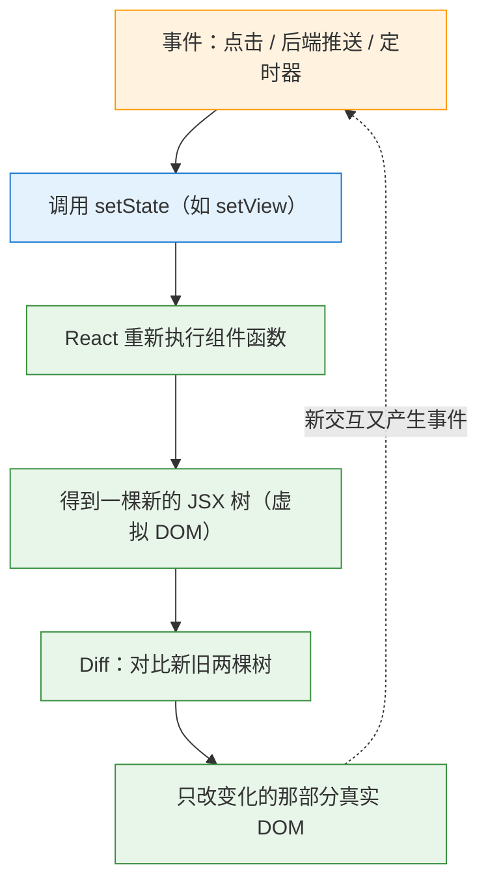
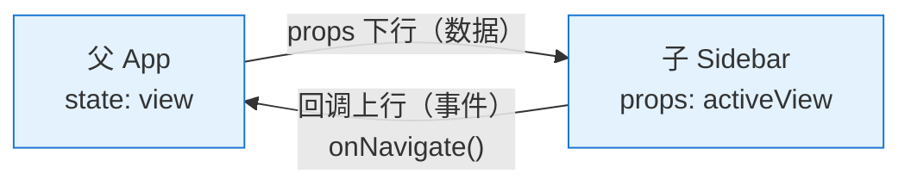
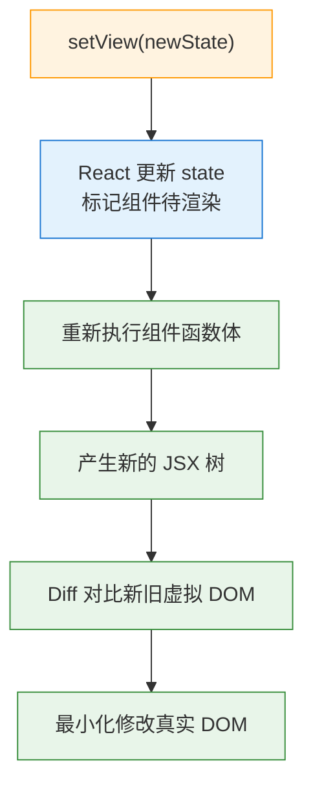
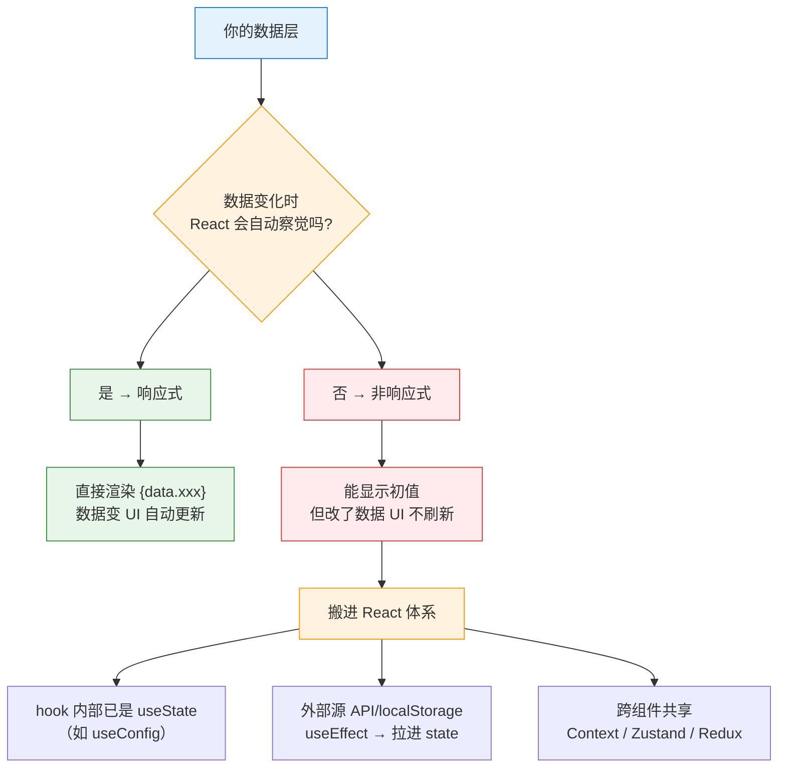
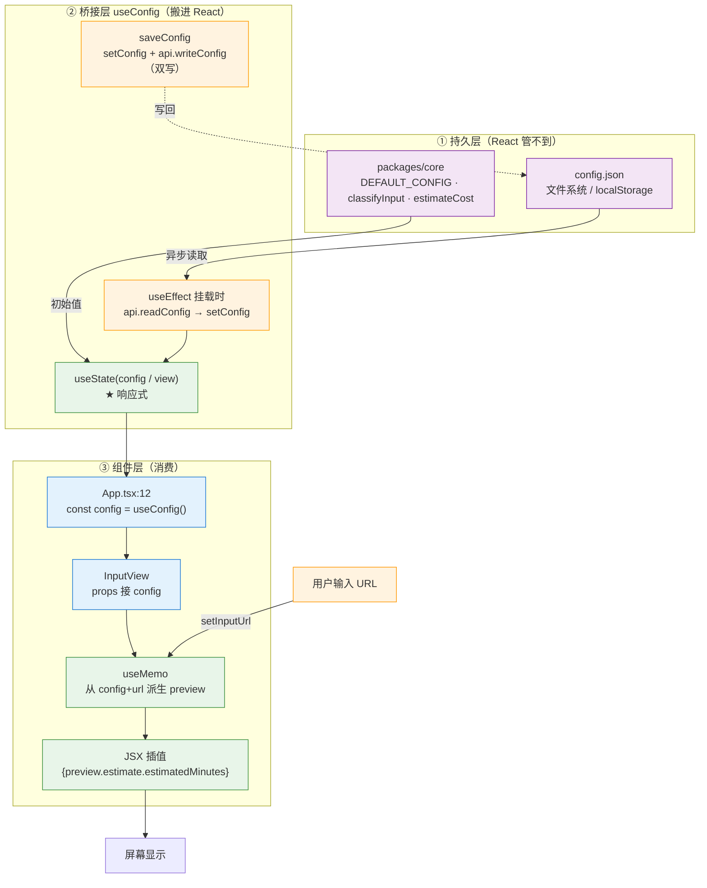

# React 数据流：从 JSX 到屏幕，一条单向链

> 一句话：**UI = f(state)**。组件是函数，props 是参数，state 是跨渲染持久的私有记忆。只有 React 管得到的 state 变了，UI 才会重渲染——这是理解一切 React 行为的钥匙。配套笔记：[[Tauri跨平台]]

---

## 0. 全景：一条链记住整篇



下面每一节都在拆这条链上的某个环节。橙色=触发，蓝色=React 内部动作，绿色=响应式数据流动。

---

## 1. JSX 是什么：语法糖，转成函数调用

```jsx
// 你写的 JSX
const el = <div className="box">hi</div>;

// 编译器看到的是
const el = React.createElement('div', { className: 'box' }, 'hi');
```

三件事：

1. `<div>` → 字符串 `'div'`（第一个参数）
2. 属性 → 对象 `{ className: 'box' }`（第二个参数）
3. 子内容 → 后续参数 `'hi'`

`createElement` 返回的是一个**普通 JS 对象**（虚拟 DOM 节点，类似 `{ type: 'div', props: {...}, children: [...] }`）。

### 关键认知：JSX 是个"值"，不是"嵌入的 HTML"

既然 JSX 表达式的值是个对象，它就能参与任何 JS 运算：

```jsx
const el = <div>hi</div>;                          // 赋值
const header = isLoggedIn ? <UserBar/> : <Login/>; // 三元
const items = data.map(x => <li key={x.id}>{x}</li>); // 数组 / map
function App() { return <div>...</div>; }          // 当返回值
```

> 这就是为什么 React 代码里到处 `{cond && <X/>}`、`{list.map(...)}`——**JSX 就是个 JS 值，能用在任何表达式里**。Vue 模板做不到（它得专门造 `v-if`/`v-for` 指令），因为模板是另一套 DSL；JSX 就是 JS 本身，控制流用原生 `if`/`for`/`map`。

> React 17+ 的新编译器不用你再 `import React`（自动注入 `jsx-runtime`），但"转成函数调用"本质没变，只是那个函数换了名字。

### 🔥 组件名为什么必须大写：这是编译规则，不是约定

既然 `<div>` 编译成 `createElement('div', ...)`（字符串），那自定义组件 `<MyButton />` 编译成什么？

```jsx
function MyButton() { return <button>click</button>; }
<MyButton />   // ← 编译成 createElement(MyButton, ...)  ← MyButton 是变量！
```

| 标签 | 编译结果 | 含义 |
|---|---|---|
| `<div>` 小写 | `createElement('div', ...)` | 字符串，查 HTML 标签 |
| `<MyButton>` 大写 | `createElement(MyButton, ...)` | **变量引用**（你定义的组件函数） |
| `<obj.Foo>` 带点 | `createElement(obj.Foo, ...)` | 成员表达式 |

**如果组件名小写**（如 `<myButton />`），编译器会把它当成 HTML 字符串 `'myButton'`，React 找不到这个标签，**静默渲染一个空的自定义元素，不报错也不显示**——这是新人最常见的"组件不渲染"bug。

### JSX 的几个小坑（结构层，记住即可）

| 坑 | 正确 | 说明 |
|---|---|---|
| `class` | `className` | `class` 是 JS 保留字 |
| `for` | `htmlFor` | 同上 |
| `style` | `style={{color:'red'}}` | 外层 `{}` = 进 JS 表达式，内层 `{}` = 对象字面量 |
| 单一根 | `<>...</>` Fragment | JSX 表达式最外层只能有一个根元素，多个用 Fragment 包 |

### 跨语言对比：JSX 就是"用 JS 写 DSL"

| 语言 | 怎么在代码里描述结构化数据 |
|---|---|
| Lua | `f{name="hi", count=5}` 是 `f({name="hi",count=5})` 的糖——用 table 当唯一参数 |
| JS + JSX | `<Foo name="hi" count={5}/>` 是 `Foo({name:"hi",count:5})` 的糖——同一个思路 |
| C++ | 没有直接对应；最接近的是"构造一个 struct 当参数传"，但没有这种语法糖 |

---

## 2. 组件 = 函数，props = 参数

React 封装 UI 的全部：**组件是一个函数，输入 props，输出 JSX。**

```jsx
function App() {
  const { view, setView, config } = useConfig();   // ← state（下一节讲）
  return (
    <Sidebar activeView={view} onNavigate={setView} />   // ← 写属性 = 传参数
  );
}
// 等价于：Sidebar({ activeView: view, onNavigate: setView })
```

组件树 = 函数调用树。`<Sidebar />` 不是魔法，就是"调用 `Sidebar()`，把结果嵌进当前 JSX"。**复杂 UI = 一棵函数调用树，每层只管自己那块。**

### props：父→子的单向只读通道

| 传的值 | 写法 |
|---|---|
| 字符串字面量 | `label="名字"` |
| 其他一切（数字/布尔/对象/数组/函数/JSX） | `count={5}` `onClick={fn}` `data={{a:1}}` |

口诀：**`{}` = "这里塞一个 JS 表达式"**。所以 `config={config}`（右边是变量名）和 `style={{color:'red'}}`（外层塞表达式、内层是对象）都是这条规则。

子组件接收（解构是惯用法）：

```tsx
interface SidebarProps {
  activeView: "input" | "dashboard" | "settings";
  onNavigate: (v: "input" | "dashboard" | "settings") => void;
}

function Sidebar({ activeView, onNavigate }: SidebarProps) { ... }
```

> `.tsx` 相比 `.jsx` 最大的价值：**props 契约在编译期被检查**。传错类型、漏传必填项，`tsc` 直接报错。

### props 是只读的、单向的

- **只读**：React 把 props 对象**冻结**了（`Object.isFrozen(props) === true`），`props.x = ...` 在严格模式直接报错。
- **单向**：数据只能父→子。子想影响父？**把"改 state 的函数"当回调传下去**：

```jsx
<Sidebar activeView={view} onNavigate={setView} />
```

`onNavigate={setView}` 传的是函数。子组件不立刻执行，而是在用户点导航时调用 `onNavigate(...)`——**实际改的是父的 state**，父重渲染，新 `activeView` 流回子。



这是个**单向环路**：数据下行（props），事件上行（回调）。传统命令式 GUI（Qt 信号槽、jQuery `.text()`）是你手动写"事件→改 DOM"；React 是你只动 state，UI 自己跟上。

### ⚠️ 对象/数组 props 是传引用，不是拷贝

`config={config}` 传进去的是**同一个对象引用**。子组件虽然不能"重新赋值"props，但如果直接 `config.theme = 'dark'`（mutate 内部字段）——**改的是父那边的同一个对象**，而 React 靠**引用是否变了**判断要不要重渲染 → 引用没变 → React 认为没变 → UI 不更新。

所以 React 世界的铁律：**永远不可变更新（immutable update）**——要改就造个新对象，别原地改：

```tsx
setConfig({ ...config, theme: 'dark' });   // ✅ 新对象，引用变了
// config.theme = 'dark'; setConfig(config); // ❌ 同一个引用，React 察觉不到
```

---

## 3. state = 跨渲染持久的记忆

### 为什么需要 useState：普通变量不行

```jsx
function MyButton() {
  let count = 0;            // ❌ 每次渲染，这行都重新执行，count 重置成 0
  return <button onClick={() => count++}>{count}</button>;  // 永远显示 0
}
```

组件函数**每次渲染都重新执行一遍**，局部变量每次新建，渲染完就没了——记不住上次的状态。

```jsx
function MyButton() {
  const [count, setCount] = useState(0);   // ✅ React 在组件实例上挂了"记忆槽"
  return <button onClick={() => setCount(count + 1)}>{count}</button>;
}
```

`useState` 的魔法：虽然 `MyButton` 每次渲染都重跑，但 React 在**这个组件实例**背后维护了一个记忆槽，值在渲染之间持久。

> **跨语言对比**：像 C++ 的 `static int count = 0;`（函数多次调用、值持久），但更精细——C++ static 是全局一个，React 是**每个组件实例各一个槽**。本质更像 JS/Lua 的闭包（closure）：内部变量能跨调用持久，只是 React 在外部替你管理。

### `useState(0)` 里的 0：初始值，只用一次

```js
const [count, setCount] = useState(0);
//       ↑      ↑               ↑
//    当前值  设置函数         初始值（首次渲染才看）
```

- 返回**长度为 2 的数组** `[当前值, 设置函数]`，`[count, setCount]` 是数组解构。
- `0` 是首次渲染的初始值。**第二次渲染起，这个 0 被 React 忽略**，返回的是内部记住的最新值。
- 初始值是什么类型，`count` 就是什么类型（传 `'hello'` 就是字符串）。

**关键**：你没法靠"改这个 0"来更新——必须调 `setCount`。

### 多个 state：默认用多个 useState

```tsx
const [count, setCount] = useState(0);
const [name, setName] = useState('');
const [isOpen, setIsOpen] = useState(false);
```

各自独立，改 `count` 不动 `name`。也可以合并成对象，但有坑（见下）。

### 同一个组件多次使用 = 多个独立实例

```jsx
<MyButton />   // 实例 A，自己的 count 槽
<MyButton />   // 实例 B，自己的 count 槽（和 A 无关）
```

同一函数定义用到两次 = 两个独立的组件实例 = 两个独立的记忆槽。**点 A 只动 A，B 不受影响。** 组件 = 可复用模板，每次使用都是独立一份 state。

### ⚠️ 直接咬你的坑：`setCount(count + 1)` 连续调

```js
function handleClick() {
  setCount(count + 1);
  setCount(count + 1);
  setCount(count + 1);
}
// 你以为 +3，实际只 +1
```

因为 `count` 是**这次渲染时的快照**（比如渲染时是 0），三次 `setCount(count + 1)` 用的都是那个旧的 `0`，算出来都是 `1`。而且 `console.log(count)` 在这里打印的还是 `0`（state 更新是异步的，这次渲染内 `count` 永远是快照值）。

正确：传**函数**，React 会把最新值喂给你：

```js
setCount(c => c + 1);   // ✅ c 是最新值，连调三次才是 +3
```

| 写法 | 连调三次 | 为什么 |
|---|---|---|
| `setCount(count + 1)` | +1 | 用的是渲染快照 |
| `setCount(c => c + 1)` | +3 | 拿到最新值 |

### ⚠️ 对象 state：setX 是替换，不是合并

```tsx
const [form, setForm] = useState({ name: '', age: 0 });

setForm({ age: 18 });          // ❌ name 被冲没了！
setForm({ ...form, age: 18 }); // ✅ 展开旧值再覆盖
```

函数组件的 `setState` 是**整体替换**（不像 class 时代的 `this.setState` 会自动合并）。取舍：相关且总是一起变的字段可合并；否则用多个 `useState` 各管各的更省心。状态特别多、互相依赖复杂时 → `useReducer`（后续）。

---

## 4. 重渲染链路：声明式怎么落地

回到第 0 节的全景图。"state 变组件重渲染"这步内部是：



**三个会翻车的点**：

1. **重渲染 = 重新执行函数，不是重画 DOM**。React 重跑组件拿到新 JSX，和旧树 Diff，**只有真正变化的部分 DOM 才会被改**。所以哪怕整个组件重跑，实际 DOM 操作可能很小。
2. **`{view === "input" && <InputView />}`** 这种条件，`view` 一变就会**挂载/卸载整个子组件**——子组件的 state 随之销毁。**这就是"切回来输入框内容没了"的根源**。
3. **`setState` 是异步批量的**。调用完下一行，state 还是旧快照。别写 `setView('x'); doSomething(view)` 指望 view 已更新。

---

## 5. 条件渲染：`&&` 短路求值

```jsx
{view === "input" && <InputView config={config} />}
```

拆三层：

- 外层 `{}`：进 JS 表达式模式
- `view === "input"`：条件，得布尔
- `<InputView />`：一个 JSX 值（对象）

### 核心：`&&` 返回操作数本身，不是布尔

| `view` | `view === "input"` | 表达式返回 | React 渲染 |
|---|---|---|---|
| `"input"` | `true` | `<InputView/>`（对象） | ✅ 显示组件 |
| `"dashboard"` | `false` | `false` | ⬜ 空白 |

> React 渲染规则：`false` / `true` / `null` / `undefined` 一律**忽略不渲染**；字符串、数字、JSX 才显示。所以 `false && JSX` 自然是"空白"。

**为什么要这么写？** JSX 的 `{}` 里只能放**表达式**，放不了 `if` 语句。条件分支只能靠表达式：二选一用三元 `cond ? <A/> : <B/>`，"有就显示没有就空"用 `cond && <X/>`。

### ⚠️ 经典坑：`0` 会被渲染出来

既然 `&&` 返回操作数本身，当左边不是布尔而是数字时：

```jsx
{count && <Badge>{count}</Badge>}
// count === 0 时：0 && <Badge/> → 返回 0（0 是 falsy，短路返回 0 本身）
// 而 React 会渲染 0！页面上凭空多出一个 "0"
```

| 左边 | 结果 | 显示 |
|---|---|---|
| `{0 && <X/>}` | 返回 `0` | ❌ 显示 "0" |
| `{"" && <X/>}` | 返回 `""` | ✅ 空字符串不显示 |
| `{null && <X/>}` | 返回 `null` | ✅ 忽略 |
| `{NaN && <X/>}` | 返回 `NaN` | ❌ 显示 "NaN" |

正确：把左边强制成布尔——`{count > 0 && <X/>}` 或 `{!!count && <X/>}`。

> 你原代码 `view === "input" && ...` **没这个坑**，因为 `===` 返回的就是布尔。坑只出现在"左边直接是非布尔值"时。

### 跨语言对比：`&&` 返回什么

| 语言 | `A && B` / `A and B` 返回 | 能用来选值吗 |
|---|---|---|
| **JS** | 操作数本身（`A` 或 `B`） | ✅（这就是条件渲染能用的原因） |
| **Lua** | 操作数本身（`A` 或 `B`） | ✅（`x = a or default` 默认值写法同源） |
| **C++** | `bool`（`true`/`false`） | ❌（布尔化了） |

JS 和 Lua 几乎一样，C++ 才是异类。

---

## 6. 数据 → UI：响应式 vs 非响应式（灵魂一问）

> **你的数据变了，React 凭什么知道要刷新 UI？**

这是所有"数据怎么显示"问题的总钥匙。答案只两种：

- **React 管得到**（是 state）→ 数据变，UI 自动更新。**响应式**。
- **React 管不到**（普通对象、文件、模块）→ 你改了它，React 不知道，**UI 不更新**。非响应式。



### 三种典型情况

**① 数据来自 hook（内部用了 useState）→ 已响应式，直接用**

```jsx
const { config } = useConfig();        // 内部是 useState
return <InputView config={config} />;   // config 变，UI 自动更新
```

**② 数据是普通对象/模块 → 非响应式，最常见的坑**

```js
// dataLayer.js
export const config = { theme: 'dark' };   // 普通对象，不是 state
```
```jsx
import { config } from './dataLayer';
return <div>{config.theme}</div>;   // ✅ 显示初值；改 config.theme → ❌ UI 不刷新
```

**③ 数据是异步来的（API、读文件）→ 用 useEffect 拉进 state**

```jsx
const [data, setData] = useState(null);
useEffect(() => {
  fetch('/api/config').then(r => r.json()).then(setData);   // 必须 setData！
}, []);
```

---

## 7. 实战：大衍决（myriad-mind-app）数据流全链路

把上面所有概念串起来，看真实项目怎么落地。先认清一个关键认知：

> **你的"数据层"是分两半的，只有一半 React 管得到。**

| 层 | 在哪 | 是什么 | React 管得到吗 |
|---|---|---|---|
| **持久/纯逻辑层** | `packages/core`（`DEFAULT_CONFIG`/`classifyInput`/`estimateCost`）+ 文件系统 `config.json` | 普通 TS 函数、磁盘文件 | ❌ 管不到 |
| **桥接层** | `apps/desktop/src/hooks/useConfig.ts` | `useState` + `useEffect` | ✅ React 的地盘 |

UI 能显示，全靠 `useConfig` 把紫色数据"染绿"——搬进 React 的 state。

### 全链路图



紫色（①）是 React 看不见的；蓝色（②③）是组件；**绿色才是真正响应式、能驱动 UI 刷新的**。整条链路就是为了把紫色数据"染绿"。

### 三步：UI 怎么消费数据

**第 1 步：拿数据**——`App.tsx:12`

```tsx
const { view, setView, config } = useConfig();   // ← config 现在是响应式的
```

**第 2 步：派生数据用 `useMemo`，别存 state**

印证第 3 节那句"能算出来的别存 state"。`InputView.tsx:101` 的 `preview` 是从 `inputUrl` + `config` **算**出来的：

```tsx
const preview = useMemo(() => {
  const classify = classifyInput(inputUrl.trim());   // 用 core 的纯函数
  const estimate = estimateCost(classify, config);
  return { classify, estimate, ... };
}, [inputUrl, config]);   // ← 依赖：inputUrl 或 config 一变，自动重算
```

`inputUrl` 变 → `setInputUrl` → 重渲染 → `useMemo` 重算 → `preview` 更新 → UI 自动刷新。**你一行"更新 DOM"的代码都没写，全声明式。**

> 记住：**派生数据用 `useMemo`，别 `useState` + 手动同步**。后者能 work 但极易写错（忘了在某处更新），且多一次渲染。

**第 3 步：JSX 插值显示**——`InputView.tsx:285`

```tsx
<span>{preview.estimate.estimatedMinutes}</span>
```

### 外部数据怎么进来：`useEffect` 拉取（`useConfig.ts:25`）

```tsx
useEffect(() => {
  (async () => {
    const raw = await api.readConfig();   // 异步：调 Tauri 后端读文件
    setConfig((prev) => ({ ...prev, ...JSON.parse(raw) }));  // ← 必须 setConfig
  })();
}, []);   // 空数组：只在挂载时跑一次
```

**为什么必须 `setConfig`？** `api.readConfig()` 是 Promise，它返回的值 React 不知道。**必须**灌进 state，React 才察觉、才肯刷新。依赖数组 `[]` = 只挂载时拉一次配置。

> 注意 `setConfig((prev) => ({ ...prev, ...parsed }))`——展开旧值合并，不是原地改。这正是第 2 节"不可变更新"的真实出现。

### 写回去要"双写"（`useConfig.ts:45`）

```tsx
const saveConfig = useCallback((c) => {
  setConfig(c);                        // ① 更新 state → UI 立刻刷新
  api.writeConfig(JSON.stringify(c));  // ② 持久化到磁盘
}, [firstLaunch]);
```

**为什么不能只写磁盘？** 磁盘文件是紫色的，React 管不到——只调 `api.writeConfig(c)`，磁盘变了但 state 没变，**UI 不刷新**。所以必须 `setConfig`（染绿）+ `writeConfig`（存盘）双写。

> 自测题：如果把 `saveConfig` 改成只调 `api.writeConfig(c)`、漏了 `setConfig(c)`：用户改完点保存，界面会刷新吗？重启 App 后配置是新的还是旧的？
> 答案：**界面不刷新**（state 没变，React 不知道），但**磁盘已存**，所以**重启后是新的**。这正好说明"持久化"和"响应式"是两件事——一个面向磁盘，一个面向内存里的 state。

---

## 8. 速查表

### React 心智模型三句话

1. **组件是函数**：输入 props，输出 JSX。组件树 = 函数调用树。
2. **state 是记忆**：跨渲染持久，挂在组件实例上。改 state 用 setter，别直接赋值。
3. **UI = f(state)**：你不写"怎么改 DOM"，你写"state 是这样时 UI 该长这样"，React 替你算。

### 数据流铁律

| 规则 | 记法 |
|---|---|
| props 只读、单向 | 父→子下行；子影响父靠回调上行 |
| state 只能 setter 改 | `setCount(c => c+1)`，别 `count++` |
| 更新必须不可变 | `{ ...obj, key: val }`，别原地 mutate |
| 派生数据用 useMemo | 能从现有 state 算出来的，别存 state |
| 外部数据 useEffect 拉进 state | API/文件/localStorage → `setState` |
| 重渲染 ≠ 重画 DOM | 重跑函数 → Diff → 只改变化部分 |

### 和传统命令式 GUI 的对照

| | 命令式（jQuery / Qt） | 声明式（React） |
|---|---|---|
| 更新 UI 怎么做 | 事件 → 手动改 DOM（`.text()`/`setText()`） | 事件 → `setState` → UI 自动跟上 |
| 数据和 UI 的关系 | 分离（HTML + JS 操作它） | 统一（UI 是 state 的函数） |
| 控制流 | 直接 `if` 改 DOM | `{cond && <X/>}` / 三元 |
| 翻车点 | 忘了同步某个 DOM | 忘了 setState / 直接 mutate / 用了非响应式数据 |

> C++/Lua 对照：声明式 React 像 ImGui（immediate mode GUI）——每帧重画 UI 函数，状态外置；传统 retained mode GUI 像 Qt——维护一棵持久的控件树，手动更新。React 是"state 变了才重跑函数"，比 ImGui 聪明（靠 Diff 跳过没变的）。
