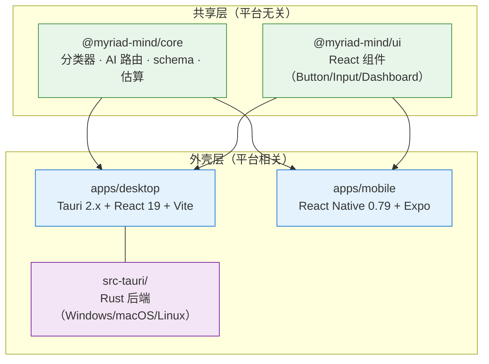
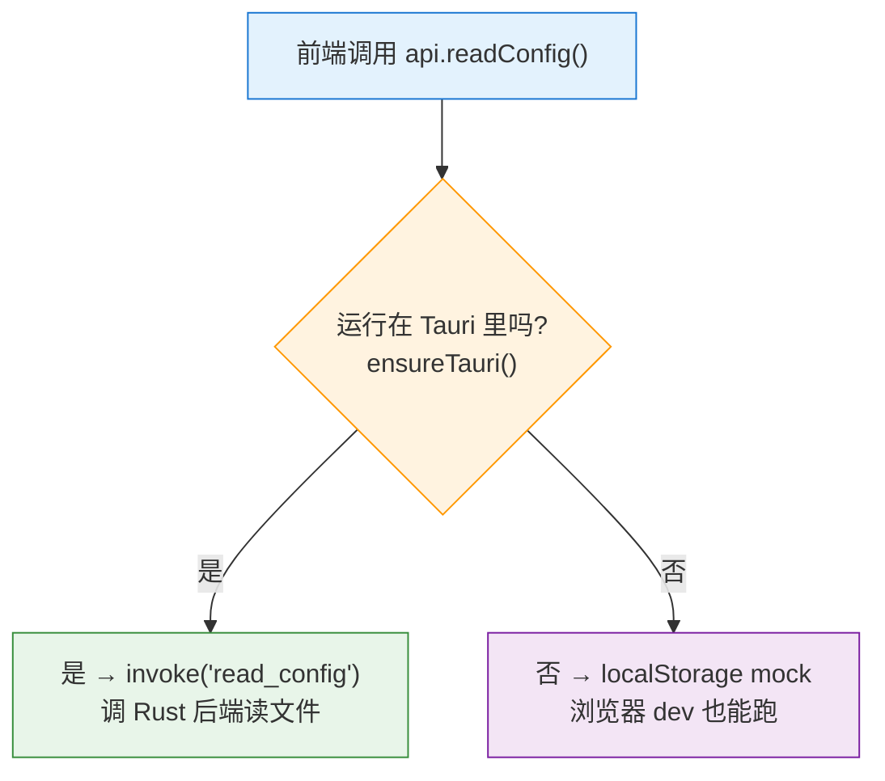

# Tauri + React 跨平台：共享什么，不共享什么

> 一句话：Tauri 能让 Windows / macOS / Linux 共用同一份前端（React）和后端（Rust），但三平台跑的是**三个不同的系统 WebView**——体积小是靠"不打包浏览器"换来的，代价是放弃渲染一致性。配套笔记：[[React数据流]]

---

## 1. 能跨平台吗：能，这是 Tauri 的核心卖点

| 层 | 共享吗 | 说明 |
|---|---|---|
| **前端 UI**（React / HTML / CSS / JS） | ✅ 100% | 这就是网页，跟平台无关 |
| **IPC 桥**（`invoke` / `event`） | ✅ | 协议层，跨平台统一 |
| **Rust 后端**（文件、网络、加密…） | ✅ | 同一份代码编译到三个目标平台 |
| **系统 WebView**（真正渲染 UI 的东西） | ⚠️ 各平台不同 | **这里会咬人，见第 3 节** |

需要平台差异时，Rust 侧用**条件编译**：

```rust
#[cfg(target_os = "windows")]
fn config_dir() -> PathBuf { /* 读 %APPDATA% */ }

#[cfg(target_os = "macos")]
fn config_dir() -> PathBuf { /* 读 ~/Library/Application Support */ }
```

> 注意 `#[cfg(...)]` 是**编译期属性**（不满足的分支根本不编译进二进制），`cfg!(target_os = "...")` 是**运行时宏**（返回 `bool`，两边的代码都编译进去）。前者用来"按平台选实现"，后者用来"运行时判断走哪个分支"。

---

## 2. "跨平台" ≠ "一份代码跑所有平台"

这是最大的误解。真实的跨平台工程是：**把平台无关的逻辑抽成共享包，平台相关的外壳各自写。**

用大衍决（myriad-mind-app）的 monorepo 结构说明——它把"共享"和"不共享"在目录层面物理隔离了：



**关键认知**：

- `packages/core`（纯 TS 逻辑：`classifyInput`、`estimateCost`、AI 路由）和 `packages/ui`（React 组件）是**平台无关**的——桌面和移动都 import 同一份。
- `apps/desktop`（Tauri）和 `apps/mobile`（RN/Expo）是**两套不同的外壳**。它们甚至不是同一个渲染体系：桌面是 WebView 渲染 React DOM，移动是 RN 把组件映射成原生控件。
- **共享的是"大脑"（逻辑 + UI 描述），不共享的是"身体"（渲染引擎 + 系统调用）。**

> 这比"Tauri 一份代码跑桌面三平台"更进一层：连桌面↔移动都能共享核心。代价是移动端不能直接用 Tauri（Tauri 2.x 虽支持 iOS/Android，但成熟度远不如桌面），所以移动端用了 RN/Expo 这条独立技术栈。

---

## 3. ⚠️ 会咬人的坑：三平台用的是三个不同的 WebView

这点和 **Electron 完全相反**，选型前必须想清楚：

| 平台 | 系统 WebView | 内核 ≈ | 随系统更新吗 |
|---|---|---|---|
| Windows | **WebView2** | Edge / Chromium | 是（Win11 自带，Win10 需装 runtime） |
| macOS | **WKWebView** | Safari / WebKit | 是（随 macOS / Safari 升级） |
| Linux | **WebKitGTK** | WebKit（老分支） | 随发行版，**版本碎片化严重** |

**后果**：

- 同一份 React 代码，**在 macOS 上可能某个 CSS 特性或 JS API 不支持**——因为 Safari 长期落后于 Chrome。
- Linux 各发行版的 WebKitGTK 版本不统一，**应用行为可能因发行版而异**（这是 Linux 桌面应用最烦的维护点）。
- 同一个 bug，你在 Windows（Chromium）上永远复现不了，用户却在 macOS（Safari）上天天踩。

### 这正是体积差异的根源

```
Tauri  产物：几 MB        ← 不打包浏览器，用系统自带的
Electron 产物：50~150 MB+  ← 打包了整个 Chromium + Node 运行时
```

**Tauri 小，是因为它"白嫖"系统 WebView；Electron 大，是因为它自带一个浏览器。** 代价镜像对称：

| | Tauri | Electron |
|---|---|---|
| 安装包体积 | 小（几 MB） | 大（几十上百 MB） |
| 内存占用 | 低 | 高 |
| 跨平台渲染一致性 | ❌ 三个内核，可能有差异 | ✅ 统一 Chromium |
| 后端语言 | Rust | Node.js |
| 升级 WebView 风险 | 有（系统更新可能改行为） | 无（自己锁版本） |

> **选型本质**：**体积/性能 ↔ 跨平台一致性**，二选一。你的应用如果对 CSS/JS 新特性依赖重、又必须三平台行为完全一致 → Electron 省心；如果在意体积和启动速度、能接受按平台测一遍 → Tauri。

---

## 4. 实战：大衍决的两层"跨平台"策略

这个项目其实做了**两层**跨平台适配，值得拆开看。

### 第一层：Tauri 环境 vs 浏览器环境（能力检测 + 降级）

`apps/desktop/src/api.ts` 里每个能力都长这样：

```ts
export async function readConfig(): Promise<string> {
  if (await ensureTauri()) return tauriInvoke!("read_config");  // 真实环境：调 Rust
  return localStorage.getItem("myriad-mind-config") ?? "{}";     // 浏览器：mock 降级
}
```



**为什么要这么搞？** 因为 `tauri dev` 启动一个真 Tauri 实例很重（要编译 Rust）。开发时直接 `vite dev` 在浏览器里跑前端会快得多——但浏览器没有 `invoke`、读不了磁盘。于是每个 API 都做"能力检测"：有 Tauri 就走真后端，没有就用浏览器 mock（localStorage 代替磁盘、假数据代替 Rust 返回）。

> 这是"开发体验"层面的跨平台：**同一份前端代码，既能跑在 Tauri 里（生产），也能跑在浏览器里（开发）**。代价是每个 API 都要写两份实现 + 一层判断。`api.ts` 那 300 行基本就是这种双实现的重复——这是为了开发速度自愿承担的样板。

### 第二层：桌面 vs 移动（共享 core/ui，外壳各异）

如第 2 节图所示。桌面用 Tauri 的 `invoke`，移动用 RN 的桥——**两套外壳，但都 import 同一个 `@myriad-mind/core`**。分类逻辑（`classifyInput`）、AI 路由、成本估算这些"大脑"只写一遍。

---

## 5. 其他会踩的点

| 坑 | 说明 |
|---|---|
| **构建/发布不能一份产物跑三平台** | CI 通常在三个 runner（Windows / macOS / Linux）上分别 `cargo build` + 打包：`.msi`/`.exe`、`.dmg`/`.app`、`.deb`/`.AppImage`。Rust 交叉编译到别的 OS 很麻烦，基本是"哪个平台 build 哪个平台"。 |
| **原生能力差异** | 托盘图标、全局快捷键、自启动这些，Tauri 有插件抽象，但**平台行为细节不一**——比如托盘在 Linux 上历来坑多。 |
| **Tauri 2.x 事件 payload 要 unwrap** | 2.x 把事件包成 `{ payload, id }`，监听时要手动取 `e.payload`（见 `api.ts:17` 的 `listen<unknown>(event, (e) => handler(e.payload))`）。1.x 不用。 |
| **路径处理** | 用 `std::path::PathBuf`，别硬编码 `/` 或 `\`。Rust 的 path 在 Windows 上自动用 `\`。 |
| **移动端是另一回事** | Tauri 2.x 支持 iOS/Android，但成熟度远不如桌面。真要做移动端，RN/Expo（像本项目的 `apps/mobile`）目前更稳。 |

---

## 6. 选型决策表

| 你的情况 | 选 | 为什么 |
|---|---|---|
| 桌面工具类应用，在意体积/启动速度 | **Tauri** | 几 MB vs 上百 MB，用户感知明显 |
| 重度依赖最新 CSS/JS 特性，必须三平台像素一致 | **Electron** | 统一 Chromium，省掉三套 WebView 的回归测试 |
| 后端逻辑重、想要类型安全 + 性能 | **Tauri**（Rust 后端） | Electron 的 Node 后端没类型、性能弱 |
| 团队只会 JS，不想碰 Rust | **Electron** | Tauri 的 Rust 门槛是真实成本 |
| 要同时覆盖桌面 + 移动 | **共享 core/ui + 各自外壳** | 别指望一套 Tauri 通吃，移动端用 RN |

---

## 7. 一句话总结

- **能共享的**：前端 UI、Rust 业务逻辑、纯 TS 的 core 包——这些是"平台无关的大脑"。
- **不能共享的**：系统 WebView（三平台三个内核）、原生外壳、构建产物。
- **Tauri vs Electron 的全部本质**：要不要自己打包浏览器。打包了 → 大但一致（Electron）；不打包 → 小但不一致（Tauri）。

> 回看：本项目（myriad-mind-app）的选择是 **Tauri（桌面）+ RN（移动）+ 共享 core/ui 包**——典型的"大脑共享，身体各自实现"。`api.ts` 的能力检测降级，则是为了让前端在浏览器里也能开发。这套结构值得作为"跨平台工程怎么落地"的参考样本。
